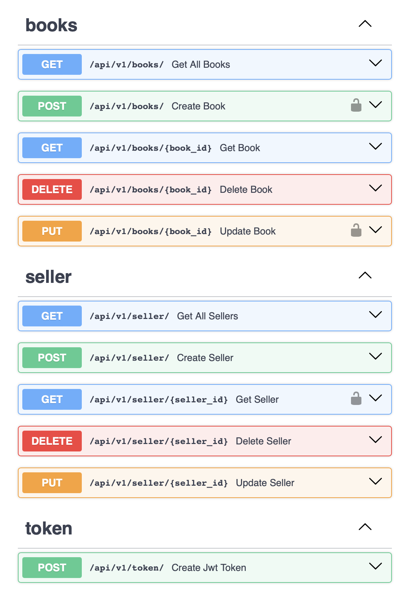

# FastAPI проект для МТС ШАД

## Краткое описание

Проект посвящен улучшению Web-приложения для интернет-магазина книг.
Работа включала добавление новых сущностей и эндпоинтов, а также внедрение системы авторизации.

**Ключевые аспекты:**

- **Модели**: Добавлена модель "Продавцы" и обновлена модель "Книги" для связи с продавцами.
- **Эндпоинты**: Реализованы эндпоинты для работы с продавцами и книгами, включая авторизацию.
- **Авторизация**: Введена система на базе JWT-токенов для защиты доступа к операциям.

**Результаты:**

Разработано расширенное приложение для продажи книг с улучшенной безопасностью и поддержкой регистрации продавцов.
Слоистая архитектура обеспечивает легкость масштабирования и обслуживания.

## Структура проекта

Для удобства и соблюдения принципов чистой архитектуры проект разделён на следующие пакеты:

- `configurations` — слой для хранения конфигураций, констант, параметров и настроек проекта.
- `models` — слой, предназначенный для описания моделей данных (ORM или Data Classes).
- `routers` — слой, отвечающий за настройку URL-адресов для различных эндпоинтов.
- `schemas` — слой, содержащий схемы Pydantic, который отвечает за сериализацию и валидацию данных.

## Технологический стек

- `Python 3.11`
- `FastAPI 0.109.0` в роли основы веб-приложения.
- `SQLAlchemy 2.0.25` и `Asyncpg 0.29.0` для работы с базой данных.
- `Pydantic 2.6.1` для валидации данных.
- `Uvicorn 0.27.0.post1` как ASGI сервер.
- `Python-JOSE 3.3.0` и `Passlib 1.7.4` для аутентификации и безопасности.
- `Orjson 3.9.12` и `Python-multipart 0.0.9` для работы с JSON и мультимедийными данными.

## Установка и запуск

1. Установите Docker Desktop: [https://www.docker.com/products/docker-desktop](https://www.docker.com/products/docker-desktop)
2. Клонируйте репозиторий.
3. На основе шаблона `.env.example` создайте свой собственный файл `.env` с ключевыми настройками.
4. Установите зависимости:
   ```bash
   # Установка зависимостей
   make install_reqs
   ```
5. При необходимости, перезапустите Pycharm, чтобы автоматически подключилось созданное в папке `.venv` окружение.
6. Запустите приложение:
   ```bash
   # Запуск БД Postgres с использованием Docker Compose
   make up_compose
   ```
   ```bash
   # Запуск приложения
   make start
   ```
   ```bash
   # Остановка контейнера Docker
   make down_compose
   ```

7. Перейдите по ссылке, чтобы открыть [Документацию API](http://127.0.0.1:8000/docs).

## Пример документации



## Тестирование

Для проверки кода и запуска тестов используйте команды:

```bash
# Запуск тестов
make pytest
```
```bash
# Запуск тестов, линтеров и авто-форматирования кода
make tests
```

## Авторы

- Бекарюков Максим
- Евгеньев Кирилл

## Полезные ссылки

#### По Fastapi:

1. [Официальная документация](https://fastapi.tiangolo.com/)

2. [Лучшие практики](https://github.com/zhanymkanov/fastapi-best-practices)

3. [Собрание полезных библиотек и пакетов](https://github.com/mjhea0/awesome-fastapi)

4. [Полезная статья по структуре проекта](https://camillovisini.com/coding/abstracting-fastapi-services)

#### По принципам REST архитектуры:

1. [Полезные рекомендации по правильному написанию REST API](<https://github.com/stickfigure/blog/wiki/How-to-(and-how-not-to)-design-REST-APIs>)

#### По SQLAlchemy:

1. [Хороший бесплатный видеокурс на YouTube. На русском языке](https://youtube.com/playlist?list=PLeLN0qH0-mCXARD_K-USF2wHctxzEVp40&si=V7rZGqu1KVJvidLz)

2. [Видеокурс построенный по официальной доке SQLAlchemy. На русском языке](https://youtube.com/playlist?list=PLN0sMOjX-lm5Pz5EeX1rb3yilzMNT6qLM&si=ShZ41fEfSR0s0op4)
